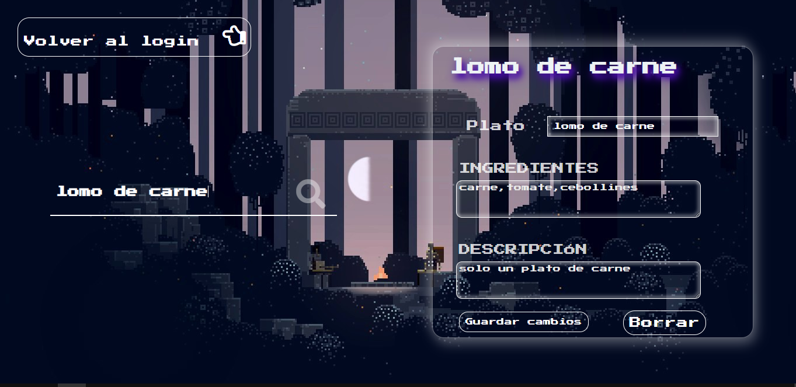

# CRUD-platillos con API REST, Sequelize con MySQL, Node.js + Express.js y AJAX(fetch)

CRUD para registrar nombre, ingredientes y descripción de un plato culinario.

Se ha puesto en práctica el uso de Node.js, Express.js, API REST, Sequelize con MySQL y AJAX(fetch).
 
IMPORTANTE --> clonar el repositorio debes y ejecutar npm i
 
IMPORTANTE!! --> crea una db con el nombre que desees (en MySQL por supuesto) y cambia en el archivo dbconfing.js las credenciales respectivas para la conexión con la base de datos
 
IMPORTANTE --> Si es que algo falta o falla al probar este proyecto, las dependecias son: 
 express morgan nodemon sequelize mysql2 ejs 
 
El proyecto tiene
 
COMO  PRIMERA PARTE ESTÁ ESTE  BELLÍSIMO LOGIN 😁😁
 

COMO SEGUNDA PARTE ESTÁ LA VISUALIZACIÓN DE PLATILLOS REGISTRADOS 🍽🍴🍻🥧😋😋
 

COMO ÚLTIMA PARTE, LA BÚSQUEDA , ACTUALIZACIÓN O ELIMINACIÓN DE ALGÚN PLATO
 

